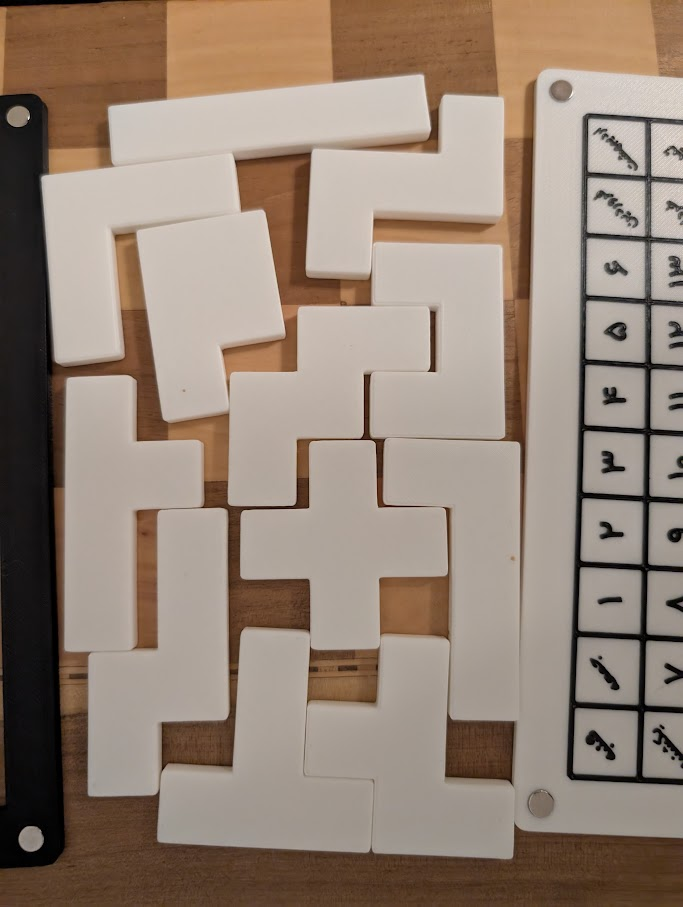

# Pentomino Calendar Puzzle

This is a 3D-printable Pentomino Calendar Puzzle designed in OpenSCAD. The puzzle is a fun and challenging way to display the current date. The goal is to fit all 12 pentomino pieces onto the board, leaving only the current month and day uncovered.

This calendar is currently in Persian.

## The Puzzle

The puzzle consists of three main parts:
- **The Base:** A grid with the months of the year and the days of the month.
- **The Lid:** A cover for the puzzle.
- **The Tiles:** 12 pentomino pieces.

## Files

- `base.scad`: The OpenSCAD file for the base of the calendar. It includes the grid for the days, months, and years.
- `lid.scad`: The OpenSCAD file for the lid of the calendar.
- `tilesv2.scad`: The OpenSCAD file for the 12 pentomino puzzle pieces.

## How to Use

1.  **3D Print the Parts:** Print the `base`, `lid`, and all 12 `tiles`.
2.  **Play:** Arrange the 12 pentomino pieces on the base to cover all the squares except for the current month and day.

## Customization

The project is designed in OpenSCAD, so you can easily customize it. For example, you can:
- **Change the language:** Modify the `Months`, `WeekDays`, and `Days` variables in `base.scad` to your desired language.
- **Change the year range:** Modify the `Years` variable in `base.scad`.
- **Adjust dimensions:** Change the `block`, `pad`, and other variables to adjust the size of the calendar.

## Dependencies

This project uses the [BOSL2 library](https://github.com/revarbat/BOSL2) for OpenSCAD. Make sure you have it installed and included in your OpenSCAD project.

## Printing and Assembly

If you want the text on the base to be a different color, you can add a pause in your slicer (e.g., OrcaSlicer) at the layer where the text begins. This will allow you to change the filament color without needing an AMS or MMU.

The lid and base are designed with holes for magnets to hold them together, but you can also use glue as an alternative.

## Disclaimer

I am not an expert in OpenSCAD. This project was created as a simple and fun experiment. The code may not be the most optimized or efficient, but it works!

Example Solution

